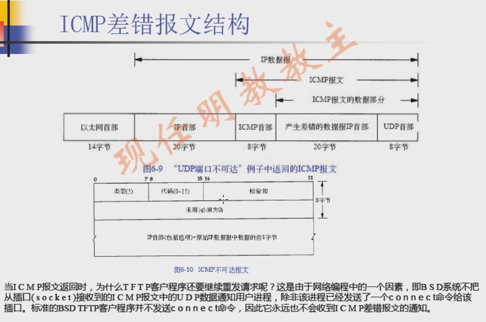
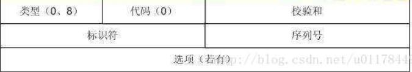
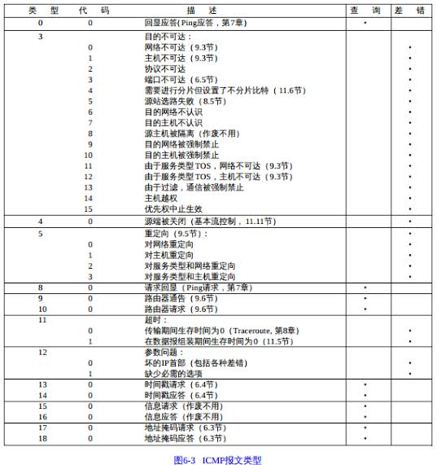
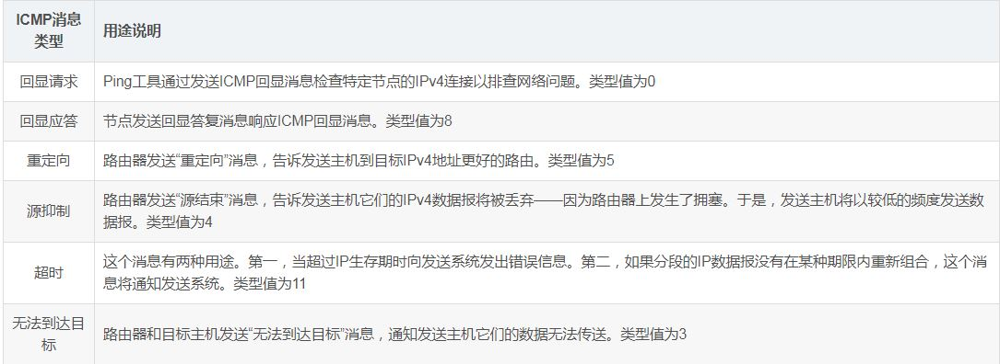
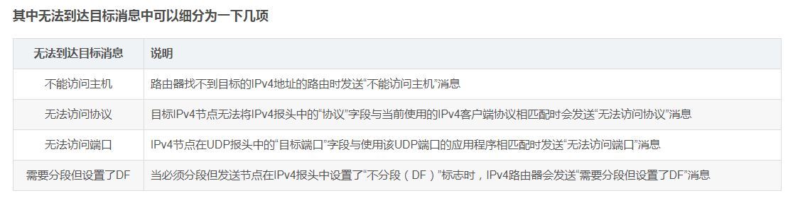

### 一、ICMP介绍

​	icmp经常被认为是IP层的一部分，它主要用来传递差错报文和查询类报文。然后，把当前的网络信息返回给用户进程。

### 二、ICMP报文介绍

1、类型（8bits）和代码（8bits）：可以有15个不同的值，用来标识特定类型的ICMP报文。

2、校验和：对IP首部、ICMP头部和数据部分进行校验。

3、标识符：在linux系统中，如果发送的是查询类报文的话，标识符字段存放的是发送进行的pid号，返回来的报文标识符不变。那么，当接收到imcp请求回显的时候，就知道是哪个进程发出去的。

4、序列号：对于同一进程发送出去的ICMP查询报文，每次序列号+1，从1开始。

### 三、ICMP常见的报文类型

​	ICMP报文类型主要是通过ICMP首部的类型字段和代码字段进行标识的，具体的报文类型如下表所示：

​	其中，类型主要有15种，有些类型还存在着不同的代码表示不同的描述信息。最后两列是表示该种类型的报文是查询报文还是差错报文。

**1、ping应答报文**

​	我们日常进行的Ping操作中就包括了相应请求（类型字段值为8）和应答（类型字段值为0）ICMP报文。一台主机向一个节点发送一个类型字段值为8的ICMP报文，如果途中没有异常（如果没有被路由丢弃，目标不回应ICMP或者传输失败），则目标返回类型字段值为0的ICMP报文，说明这台主机存在。

**2、目标不可达，源抑制和超时报文**

​	这三种报文的格式是一样的。目标不可到达报文（类型值为3）在路由器或者主机不能传递数据时使用。例如我们要连接对方一个不存在的系统端口（端口号小于1024）时，将返回类型字段值3、代码字段值为3的ICMP报文。常见的不可到达类型还有网络不可到达（代码字段值为0）、主机不可达到（代码字段值为1）、协议不可到达（代码字段值为2）等等。 

​	源抑制报文（类型字段值为4，代码字段值为0）则充当一个控制流量的角色，通知主机减少数据报流量。由于ICMP没有回复传输的报文，所以只要停止该报文，主机就会逐渐恢复传输速率。最后，无连接方式网络的问题就是数据报回丢失，或者长时间在网络游荡而找不到目标，或者拥塞导致主机在规定的时间内无法重组数据报分段，这时就要触发ICMP超时报文的产生。 
​	超时报文（类型字段值为11）的代码域有两种取值：代码字段值为0表示传输超时，代码字段值为1表示分段重组超时。

### 四、以下几种情况不会产生ICMP报文

1、ICMP差错报文不产生ICMP报文，但是ICMP查询报文有可能产生ICMP差错报文。

2、目的地址是广播地址或多播地址的IP数据报。（主要是为了防止广播风暴）

3、不是IP分片的第一片

### 五、ping和traceroute

1、ping

（1）用途

​	能验证网络的连通性 
​	会统计响应时间和TTL(IP包中的Time To Live，生存周期) 

（2）如何验证

​	ping命令会先发送一个 ICMP Echo Request给对端 
​	对端接收到之后, 会返回一个ICMP Echo Reply 
​	若没有返回，就是超时了，会认为指定的网络地址不存在。

2、traceroute

（1）用途

​	基于ICMP协议，用于记录从源主机到目标主机之间经过多少路由。